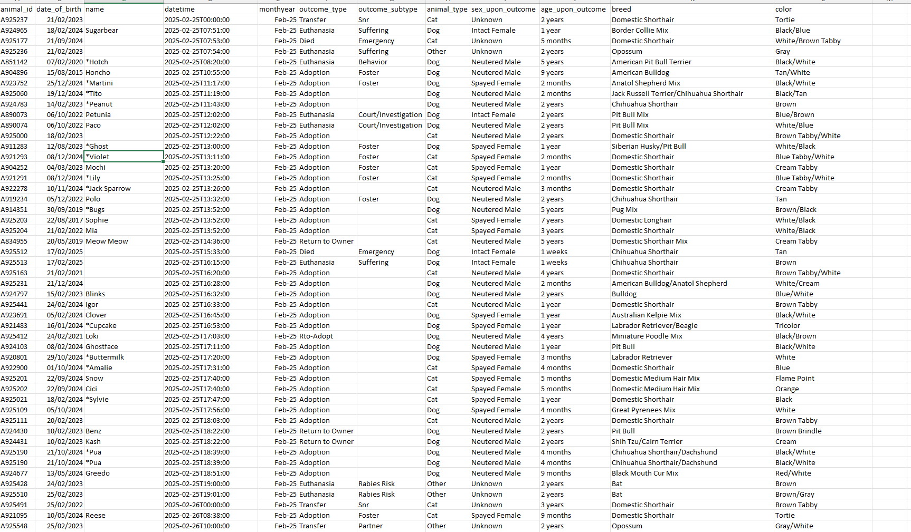
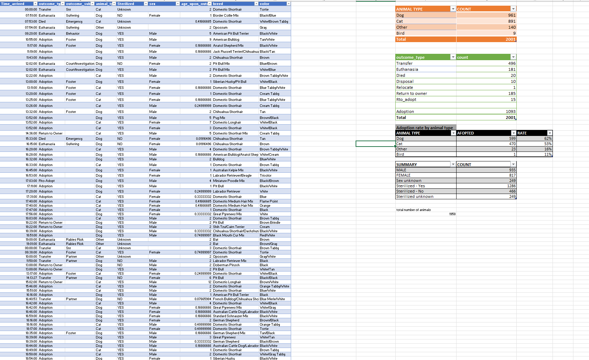

# Data Cleaning: Week 2

A short description of what was cleaned and why.

## 📂 Files

| File | Description |
|------|-------------|
| [shelter-outcomes-RAW.xlsx](shelter-outcomes-RAW.xlsx) | Original dataset |
| [raw-data.png](raw-data.png) | Screenshot of the raw data |
| [cleaned-data.png](cleaned-data.png) | Screenshot of the cleaned data |

## 📊 Dataset
- **Download:** [shelter-outcomes-RAW.xlsx](shelter-outcomes-RAW.xlsx?raw=true)
- **Source:** Where the data came from
- **Rows / Columns:** e.g. 1,000 rows, 8 columns

## 🛠️ Tools Used
- Microsoft Excel

## 🔍 Cleaning Steps
1. Step one
2. Step two
3. Step three

## 🖼️ Screenshots

### Before (Raw Data)

### After (Cleaned Data)

[⬅ Back to Data Analysis Club](../README.md)
